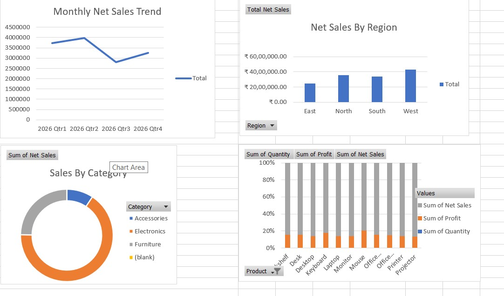
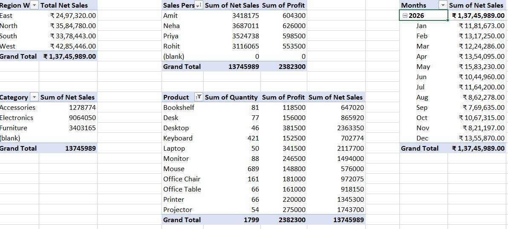
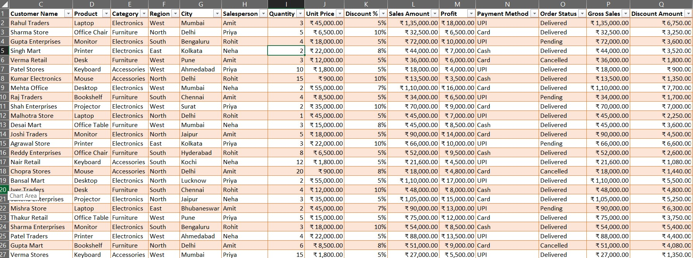

# Excel Sales Performance Dashboard

Interactive sales dashboard built using Excel.

## Tools Used
- Pivot Tables, Pivot Charts
- Slicers & Timelines
- VLOOKUP / XLOOKUP, Conditional Formatting

## Dashboard Overview

## Key Insights
- Analyzed overall sales performance by region & product
- Created interactive filters for dynamic reporting

## Files
- Project(SALES).xlsx - Main Excel workbook
